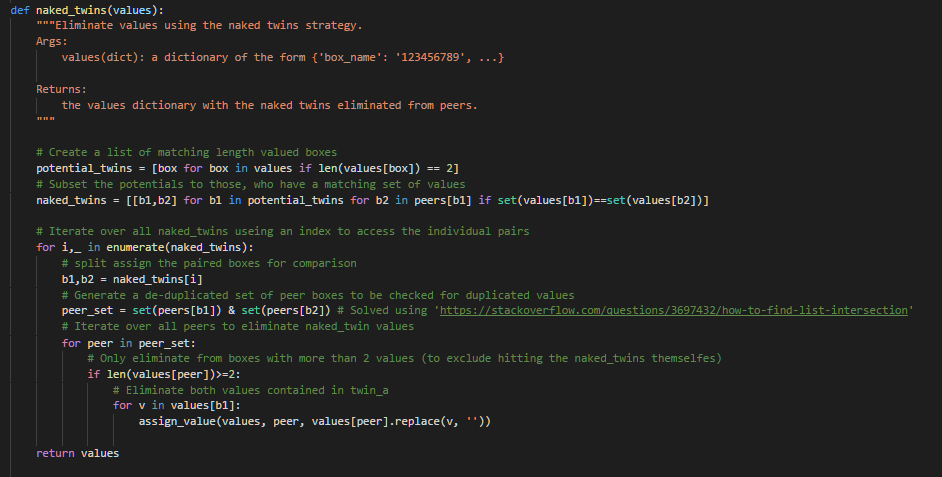
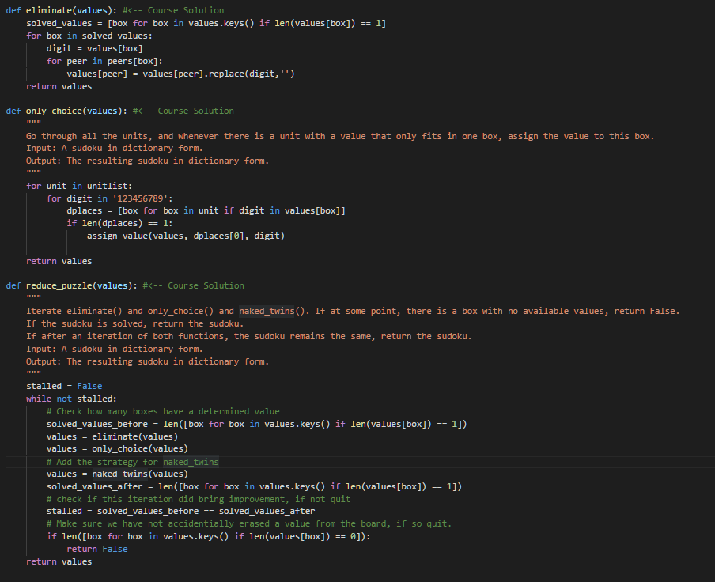
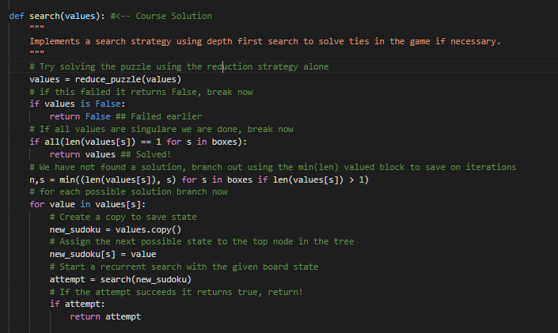
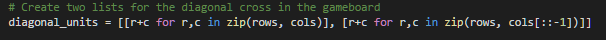
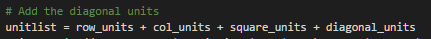

# Artificial Intelligence Nanodegree
## Introductory Project: Diagonal Sudoku Solver

# Question 1 (Naked Twins)
Q: How do we use constraint propagation to solve the naked twins problem?  
A: Constraint Propagation uses an interative application of a set of constraining fact (rules) onto a given problem space tor reduce the possible number of solutions until convergence if possible.

Naked Twins is a strategy to quickly reduce the necessary number of iterations of Constraint Progapagation leveraging the power of twin valued boxes during the last stage of problem solving for a neighborhood of values. 

We identify a pair of boxes in the same neighborhood that hold identical values of length 2, and eliminate those from all neighboring peer-boxes.

The Code implementation first created a list of lists containing the boxes at which a duplicate set of values with length 2 was found, iterated over them to identify their common neighboring boxes and removed the duplicated values from all of them. Key to a successfull solution proved to be the efficient creation of a joint set of peers as illustrated below.

Naked_twins was used together with two other constraint strategies (only_choice) and (eliminate) to reach the solution.

To solve complicated Sudoku Grids, an iterative 'depth first search' routine was used to create a recursive procedure to branch out of stagnant states of local minima in the constraint propagation logic. For efficiency, a stagnant state was broken at the square with the min number of possible values for branch creation. Each possible value was tried and solved using constraint propagation until a finishing state was reached. 

# Question 2 (Diagonal Sudoku)
Q: How do we use constraint propagation to solve the diagonal sudoku problem?  
A: The Diagonal Sudoku provides us with one additional requirement for a solution that needs to be incorporated both in the representation of the problem space (the board) as well as handled in a constraint propagation rule. 

The additional rule introduced tells us to find a solution that also constraints the board to have non repetitive numbers from 1-9 on both of its main diagonals, which form a cross starting at (1,1) and (1,9) respectively crossing the board. 

First they needed to be represented as boxes.

Then they where added to the overall unit representation.

### Install

This project requires **Python 3**.

We recommend students install [Anaconda](https://www.continuum.io/downloads), a pre-packaged Python distribution that contains all of the necessary libraries and software for this project. 
Please try using the environment we provided in the Anaconda lesson of the Nanodegree.

##### Optional: Pygame

Optionally, you can also install pygame if you want to see your visualization. If you've followed our instructions for setting up our conda environment, you should be all set.

If not, please see how to download pygame [here](http://www.pygame.org/download.shtml).

### Code

* `solution.py` - You'll fill this in as part of your solution.
* `solution_test.py` - Do not modify this. You can test your solution by running `python solution_test.py`.
* `PySudoku.py` - Do not modify this. This is code for visualizing your solution.
* `visualize.py` - Do not modify this. This is code for visualizing your solution.

### Visualizing

To visualize your solution, please only assign values to the values_dict using the `assign_value` function provided in solution.py

### Submission
Before submitting your solution to a reviewer, you are required to submit your project to Udacity's Project Assistant, which will provide some initial feedback.  

The setup is simple.  If you have not installed the client tool already, then you may do so with the command `pip install udacity-pa`.  

To submit your code to the project assistant, run `udacity submit` from within the top-level directory of this project.  You will be prompted for a username and password.  If you login using google or facebook, visit [this link](https://project-assistant.udacity.com/auth_tokens/jwt_login) for alternate login instructions.

This process will create a zipfile in your top-level directory named sudoku-<id>.zip.  This is the file that you should submit to the Udacity reviews system.

